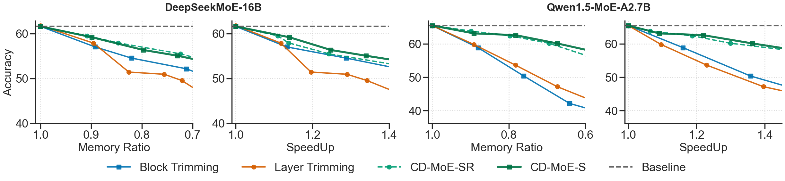
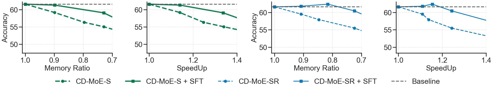
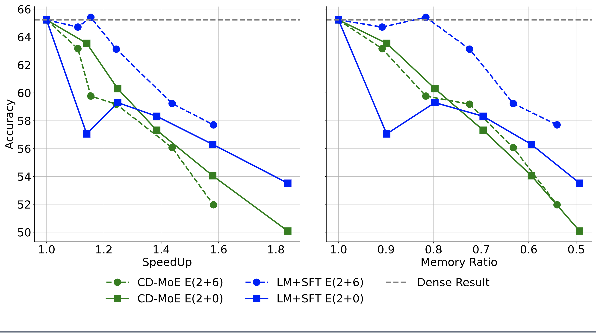

## CONDENSE, DON’T JUST PRUNE: ENHANCING EFFICIENCY AND PERFORMANCE IN MOE LAYER PRUNING

Official PyTorch implementation of CD-MOE, as presented in our paper: CONDENSE, DON’T JUST PRUNE: ENHANCING EFFICIENCY AND PERFORMANCE IN MOE LAYER PRUNING

[Mingyu Cao](https://scholar.google.com/citations?user=nq7uHwQAAAAJ&hl=en&oi=ao), [Gen Li](https://scholar.google.com/citations?hl=en&user=4nzCXV8AAAAJ), [Jie Ji](https://scholar.google.com/citations?hl=en&user=aoGaDN4AAAAJ), [Jiaqi Zhang](www.baidu.com), [Xiaolong Ma](https://xiaolongma2016.com/), [Shiwei Liu](https://shiweiliuiiiiiii.github.io/), [Lu Yin](https://luuyin.com//)

**Shopee, Clemson University, Meituan, University of Oxford, University of Surrey**


## Abstract
Mixture-of-Experts (MoE)  has garnered significant attention for their ability to scale up neural networks while utilizing the same or even fewer active parameters. However, MoE does not relieve the massive memory requirements of networks, which limits their practicality in real-world applications, especially in the era of large language models (LLMs). While recent work explores the possibility of removing entire layers of MoE to reduce memory, the performance degradation is still notable. In this paper, we propose Condense-MoE (CD-MoE) that, instead of dropping the entire MoE layer, condenses the big, sparse MoE layer into a small but dense layer with only a few experts that are activated for all tokens. Our approach is specifically designed for fine-grained MoE with shared experts, where Feed-Forward Networks are split into many small experts, with certain experts isolated to serve as shared experts that are always activated. We demonstrate the effectiveness of our method across multiple MoE models such as DeepSeekMoE and QwenMoE on various benchmarks. Specifically, for the DeepSeekMoE-16B model, our approach maintains nearly 90% of the average accuracy while reducing memory usage by 30%  and enhancing inference speed by 30%. Moreover, we show that with lightweight expert fine-tuning, the pruned model can achieve further improvements on specific tasks. 

## Results
<p align="center">
    
</p>

<p align="left">
    CD-MoE against baselines on DeepSeekMOE-16B. Left: Average accuracy with varying SpeedUp against the dense model. Right: Average accuracy with varying Memory Ratio against the dense model. The Gray dotted line is the dense model result. E(2+0) represents 2 shared experts and no routing experts, and E(2+6) represents 2 shared with 6 routing experts.
</p>

<p align="center">
    
</p>

<p align="left">
    CD-MoE against baselines on Qwen1.5-MoE-2.7B. Left: Average accuracy with varying SpeedUp against the dense model. Right: Average accuracy with varying Memory Ratio against the dense model. The Gray dotted line is the dense model result. E(4+0) represents 4 shared experts with 4 routing experts, and E(4+4) represents 4 shared experts with 4 routing experts.
</p>


<!-- 
CD-MoE on finetuning. Left: Average accuracy with varying SpeedUp. Right: Average accuracy with varying Memory Ratio. The Gray dotted line is the dense model result. CD-MoE and LM+SFT represent condensed and supervision fine-tuned models, respectively. E(2+0) represents 2 shared experts and no routing experts, and E(2+6) represents 2 shared with 6 routing experts. -->


## Setup

```bash
git clone https://github.com/duterscmy/CD-MoE.git
cd CD-MoE
pip install -e .
pip install -r requirements.txt
```

## Usage

The process mainly consists of three steps: (1) obtaining the average weights of the experts, (2) selecting experts and layers through greedy search, and (3) fine-tuning the experts. The first two steps are mandatory, while the last step is optional. First, you need to download the official deepseek16B-MOE model to the local directory `$model_path`.

### 1. Expert Weight

```bash
cp cd-moe/get_weight/modeling_deepseek.py $model_path
python cd-moe/get_weight/get_weight.py \
    --input $calibration_data_file \
    --output $expert_weight_file \
    --model $model_path
```

### 2. Greedy Search

The greedy search expert must be done before the greedy search layer.

#### Greedy Search Expert

```bash
cp cd-moe/greedy_search/modeling_deepseek.py $model_path
python cd-moe/greedy_search/greedy_search_expert.py \
    --input $calibration_data_file \
    --model $model_path \
    --dynamic-weight-file $expert_weight_file \
    --output $greedy_search_expert_result_file
```

#### Greedy Search Layer

```bash
prune_num_expert=6
prune_num_lauer=9
python cd-moe/greedy_search/greedy_search_layer.py \
    --input $calibration_data_file \
    --model $model_path \
    --dynamic-weight-file $expert_weight_file \
    --greedy-expert-file $greedy_search_expert_result_file \
    --output $greedy_search_layer_result_file \
    --prune-num-expert $prune_num_expert \
    --prune-num-layer $prune_num_layer
```

### 3. Fine-tune (Optional)
The prune experts and layers in `cd-moe/exp_hyper.py` need to match the options in `cd-moe/finetune/finetune.py`, and replace the file paths in `cd-moe/modeling_deepseek.py` with real paths. You can use the `--no-c4` option to skip lm fine-tuning and directly fine-tune for downstream tasks.

```bash
echo "num_route_experts=${prune_num_expert};prune_layer_num=${prune_num_layer}" > cd-moe/exp_hyper.py
cp cd-moe/modeling_deepseek.py cd-moe/exp_hyper.py $model_path
python cd-moe/finetune/finetune.py \
    --input $sft_data \
    --c4-input $lm_data \
    --model $model_path \
    --dynamic-weight-file $expert_weight_file \
    --greedy-expert-file $greedy_search_expert_result_file \
    --greedy-layer-file $greedy_search_layer_result_file \
    --output-dir $sft_model_path \
    --prune-num-expert $prune_num_expert \
    --prune-num-layer $prune_num_layer
```

For some intermediate variables, we provide some already generated results:
- calibration_data_file(100 c4 texts): `cd-moe/data/calibration_data.json`
- expert_weight_file: `cd-moe/data/dynamic_weight.json`
- greedy_search_expert_result_file: `cd-moe/data/layer_idx_to_expert_idx.greedy_jl.json`
- greedy_search_layer_result_file: `cd-moe/data/layer_idx_order.e6.json` and `cd-moe/data/layer_idx_order.e0.json`
.The open-source model and C4 training data need to be downloaded locally:
- [DeepseekMoE-16B](https://huggingface.co/deepseek-ai/deepseek-moe-16b-base)
- [C4 dataset](https://huggingface.co/datasets/allenai/c4)
- [SFT datasets](https://huggingface.co/datasets/pengxiang/OwLore_Dataset)

## Evaluation

Install [lm-evaluation-harness](https://github.com/EleutherAI/lm-evaluation-harness)  
Evaluate the pruned model or the finetuned model:
```bash
cp $expert_weight_file $greedy_search_expert_result_file $greedy_search_layer_result_file cd-moe/modeling_deepseek.py $model_path
lm_eval --model hf \
    --model_args pretrained=$model_path,dtype="bfloat16",trust_remote_code=True \
    --tasks arc_challenge,boolq,piqa,rte,obqa,winogrande,mmlu,hellaswag \
    --device cuda:0 \
    --batch_size 32
# batch_size cannot be set to `auto` because of the model implement
```

## Acknowledgement
This repository is build upon the [Transformers](https://github.com/huggingface/transformers) repositories.

## Citation
if you find this repo is helpful, please cite
```bibtex
@misc{cao2024condensedontjustprune,
      title={Condense, Don't Just Prune: Enhancing Efficiency and Performance in MoE Layer Pruning}, 
      author={Mingyu Cao and Gen Li and Jie Ji and Jiaqi Zhang and Xiaolong Ma and Shiwei Liu and Lu Yin},
      year={2024},
      eprint={2412.00069},
      archivePrefix={arXiv},
      primaryClass={cs.LG},
      url={https://arxiv.org/abs/2412.00069}, 
}
```